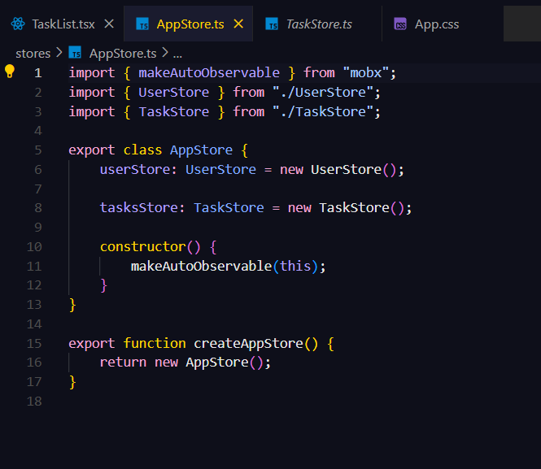
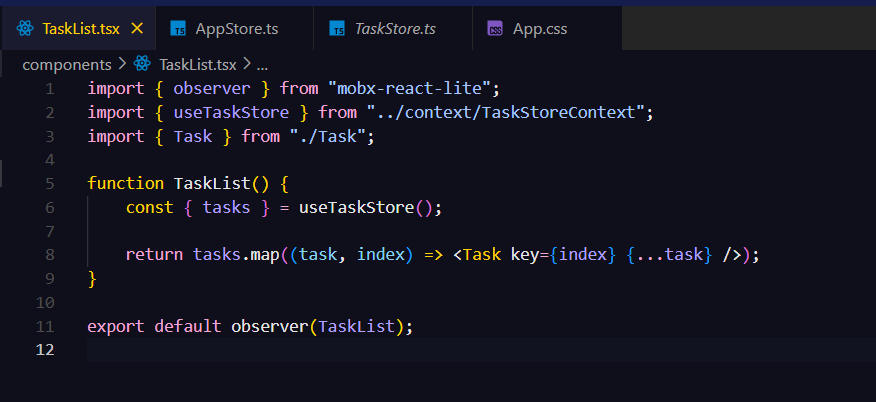
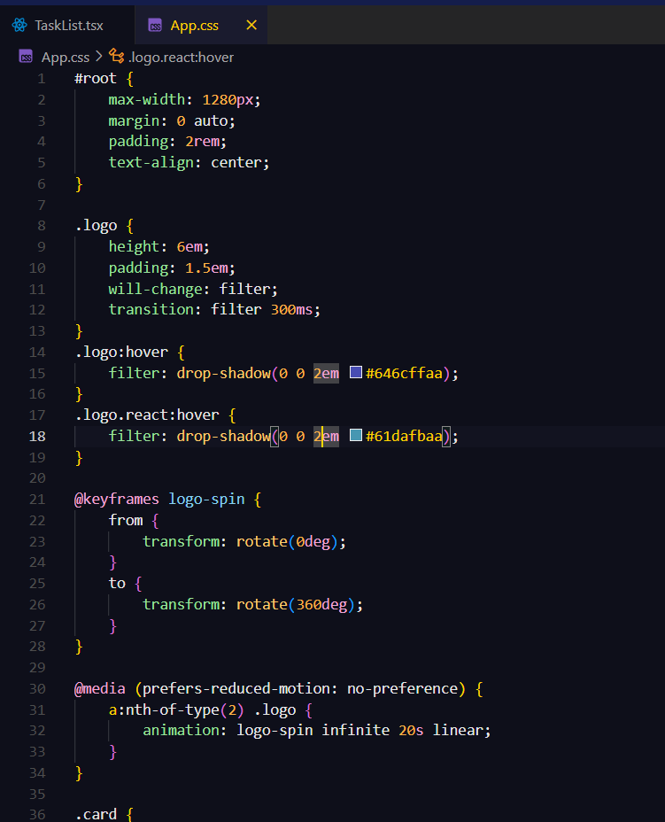
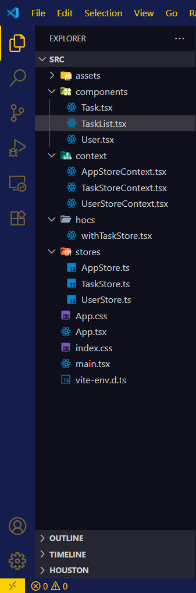

# 🎨 Bocchi Boca Juniors Theme Dark

Un tema oscuro para Visual Studio Code inspirado en **Bocchi the Rock!** y el club **Boca Juniors** 🇦🇷💙💛.  
Ideal para quienes quieren programar con el espíritu xeneize y un toque anime.

## ✨ Características

- **Paleta principal**: Azul oscuro (`#00133d`) y dorado (`#FFD100`), con acentos verdes para comentarios y detalles.
- **Compatibilidad**: HTML, CSS, JavaScript, TypeScript, JSX y TSX.
- **Diseño pensado para legibilidad**: Colores diferenciados para palabras clave, cadenas, números y funciones.
- **Comentarios verdes** (`#6A9955`) para facilitar la lectura y organización del código.

## 📸 Capturas

> *(Agrega aquí imágenes de ejemplo con tu tema aplicado en distintos lenguajes)*

## 📥 Instalación

1. Abre **Visual Studio Code**.
2. Ve a la sección **Extensiones** (`Ctrl+Shift+X` o `Cmd+Shift+X` en macOS).
3. Busca **"bocchi-boca-juniors-theme-dark"**.
4. Haz clic en **Instalar**.
5. Activa el tema:  
   - **Comando**: `Ctrl+K Ctrl+T` (Windows/Linux) o `Cmd+K Cmd+T` (macOS).  
   - Selecciona **Bocchi Boca Juniors Theme Dark**.

## ⚽ Inspiración

- **Bocchi the Rock!**: Energía, creatividad y diversión.
- **Boca Juniors**: Pasión, identidad y orgullo xeneize.

## 📄 Licencia

Este tema es de uso libre bajo licencia **MIT**.
